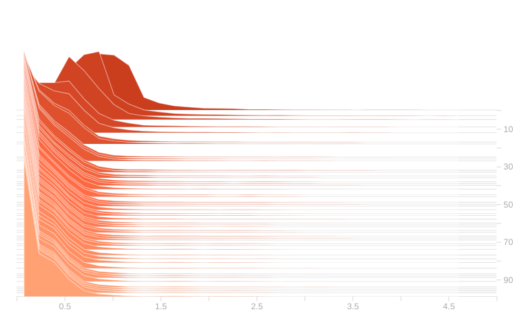
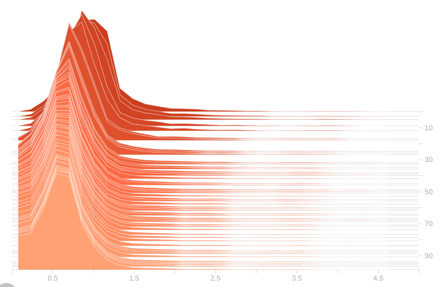
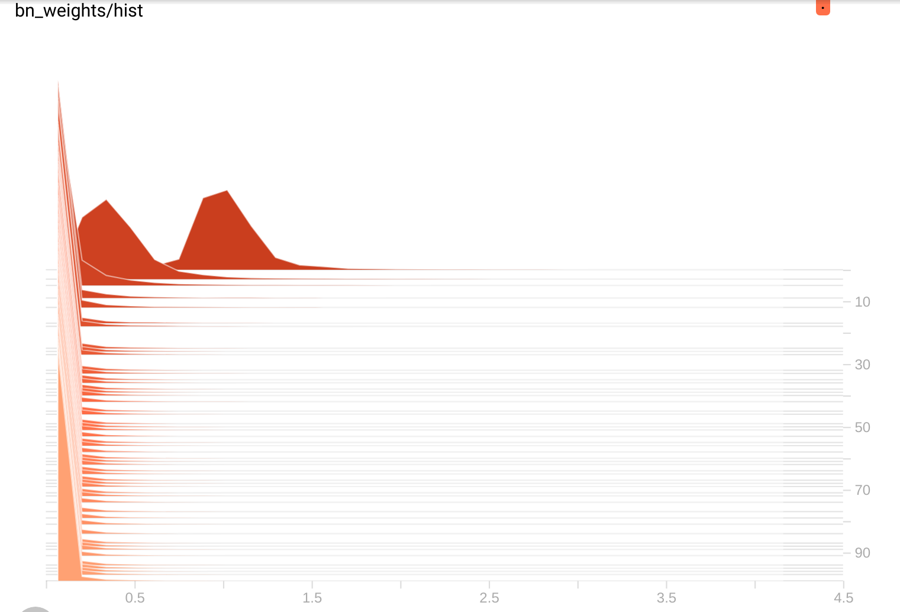
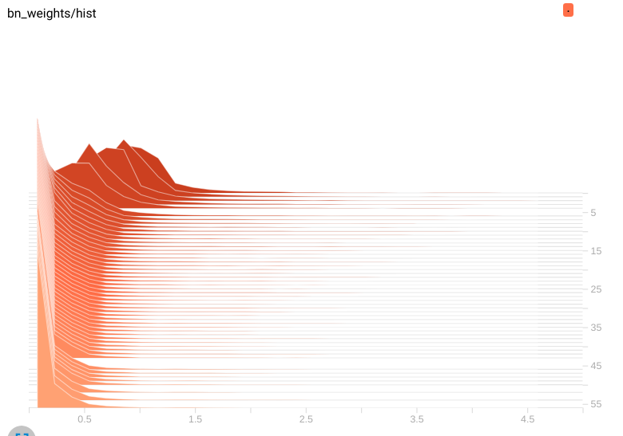
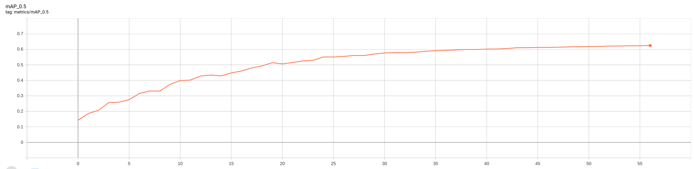

## yolov5模型剪枝

yolov5 剪枝, 基于最新v6.0分支,目前支持yolov5所有模型剪枝.

### updates

```2022-1-3```支持最新v6.0分支n/s/m/l等模型剪枝.

```2022-1-1```支持最新v6.0分支s模型剪枝.

### BN层剪枝

在VOC2007数据集上实验,训练集为VOC07 trainval, 测试集为VOC07 test.作为对比,这里列举了faster rcnn和SSD512在相同数据集上的实验结果, yolov5输入大小为512.为了节省时间,这里所有实验使用AdamW训练100 epoch.使用SGD+300epoch+0.01=>0.001的参数设置通常会有更好的结果.

1. 正常训练:

   ```
   python train.py --weights yolov5s.pt --data data/voc.yaml --epochs 100 --imgsz 512 --adam ...
   ```

   训练一个未剪枝的baseline,这里voc07上为0.706

2. 检测

   ```
   python detect.py --weights runs/train/exp*/weights/last.pt --data data/voc.yaml
   ```

3. 稀疏训练

   ```
   python train_sparity.py --st --sr 0.0002 --weights yolov5s.pt --data data/voc.yaml --epochs 100 --imgsz 512 --adam ...
   ```

   训练中需要通过tensorboard监控训练过程,特别是map变化,bn分布变化等,在runs/train/exp*/目录下有events.out.tfevents.* 文件,在此目录下输入:

   ```
   tensorboard --logdir .
   ```

   然后根据提示浏览器打开http://localhost:6006/即可,这里可以看到bn训练中分布如下

   <p align="center">
   
   </p>

   可以看到随着训练(纵轴从上往下)进行,直方图逼近0附近,说明大多数bn已经变得稀疏,同时需要观察map变化是否正常.

   如果sr设置过小,会稀疏地较慢,情况如下:

   <p align="center">
   
   </p>

   如果sr设置过大,稀疏过快也不好:

   <p align="center">
   
   </p>

   这种情况通常掉点严重甚至Nan报错.

4. 剪枝

   ```
   python prune.py --percent 0.5 --weights runs/train/exp2/weights/last.pt --data data/voc.yaml --cfg models/yolov5s.yaml
   ```

   会保存剪枝后模型pruned_model.pt. 注意--cfg参数对应的模型应该和--weights对应模型一致.

5. 微调

   ```
   python finetune.py --weights pruned_model.pt --data data/voc.yaml --epochs 100 --imgsz 512 --adam ...
   ```

6. 检测

   ```
   python detectpruned.py --weights runs/train/exp*/weights/last.pt --data data/voc.yaml
   ```

   一些实验如下:

| model             | size | sr     | mAP@.5       | Speed CPU b1(ms) | Speed rtx2070 b1(ms) | params(M) | FLOPs@512 (B) | GPU Mem(MB) | model size |
| ----------------- | ---- | ------ | ------------ | ---------------- | -------------------- | --------- | ------------- | ----------- | ---------- |
| faster rcnn       |      |        | 0.699(paper) |                  |                      |           |               |             |            |
| SSD512            | 512  | 0      | 0.716(paper) |                  |                      |           |               |             |            |
| yolov5n           | 512  | 0      | 0.655        | 23.6             | 5.4                  | 1.78      | 4.2           |             |            |
| yolov5s           | 512  | 0      | 0.706        | 43.3             | 5.5                  | 7.06      | 16.0          | 871         |            |
| yolov5l           | 512  | 0      | 0.743        | 162.2            | 12.9                 | 46.21     | 108.1         |             |            |
| yolov5l6          | 512  | 0      | 0.74         | 176.5            | 16.5                 | 76.26     | 110.4         |             |            |
| yolov5s           | 512  | 0.001  | 0.66         |                  |                      |           |               |             |            |
| yolov5s           | 512  | 0.0001 | 0.702        |                  |                      |           |               |             |            |
| yolov5s           | 512  | 0.0002 | 0.674        |                  |                      |           |               |             | 28.7       |
| yolov5s-50% prune | 512  | -      | 0.65         |                  |                      |           |               |             | 11.7       |
| finetune above    |      |        | 0.662        | 44.1             | 6.9                  |           |               | 867         |            |
| yolov5l           | 512  | 0.0001 | 0.686        |                  |                      |           |               |             |            |
| yolov5l-40% prune | 512  |        | 0.646        |                  |                      |           |               |             |            |

### yolov5l实验记录

设置sr=0.0005进行稀疏训练,观察训练过程中:

<p align="center">

</p>

<p align="center">

</p>

在训练才55epoch时发现稀疏过快,同时map在0.625附近,距离正常训练map 0.743差距较大,于是设置sr=0.0001重新训练.

## TD

- [x] yolov5 branch v6.0 model prune.
- [x] support yolov5n/m/l/x  and yolov5n/s/ml/x6.
- [ ] knowledge distillation.
